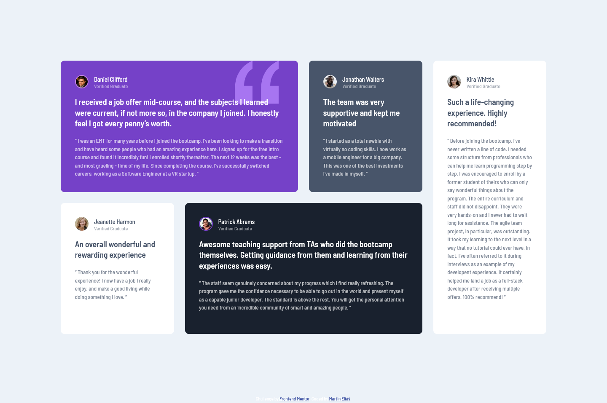
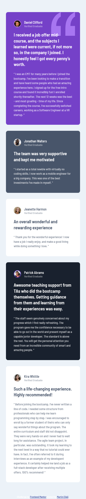

# Frontend Mentor - Testimonials grid section solution

This is a solution to the [Testimonials grid section challenge on Frontend Mentor](https://www.frontendmentor.io/challenges/testimonials-grid-section-Nnw6J7Un7). Frontend Mentor challenges help you improve your coding skills by building realistic projects. 

## Table of contents

- [Overview](#overview)
  - [The challenge](#the-challenge)
  - [Screenshot](#screenshot)
  - [Links](#links)
- [My process](#my-process)
  - [Built with](#built-with)
  - [What I learned](#what-i-learned)
  - [Continued development](#continued-development)
  - [Useful resources](#useful-resources)
- [Author](#author)

## Overview

### The challenge

Users should be able to:

- View the optimal layout for the site depending on their device's screen size

### Screenshot

### Links

- Solution URL: [Add solution URL here](https://your-solution-url.com)
- Live Site URL: [Add live site URL here](https://your-live-site-url.com)

## My process

### Built with

- Semantic HTML5 markup
- CSS custom properties
- CSS variables
- Flexbox
- CSS Grid
- Mobile first workflow

### What I learned

I have learned hot use to CSS grid layout to produce fully responsive page.

### Continued development

CSS grid is a very useful technique which frontend web dev should know, so i´ll focus to master it. 

### Useful resources

- [CSS Grid](https://css-tricks.com/snippets/css/complete-guide-grid/)

## Author

- LinkedIn - [Martin Eliáš](https://www.linkedin.com/in/martin-eli%C3%A1%C5%A1-455550209/)
- Frontend Mentor - [@smradupan](https://www.frontendmentor.io/profile/smradupan)
